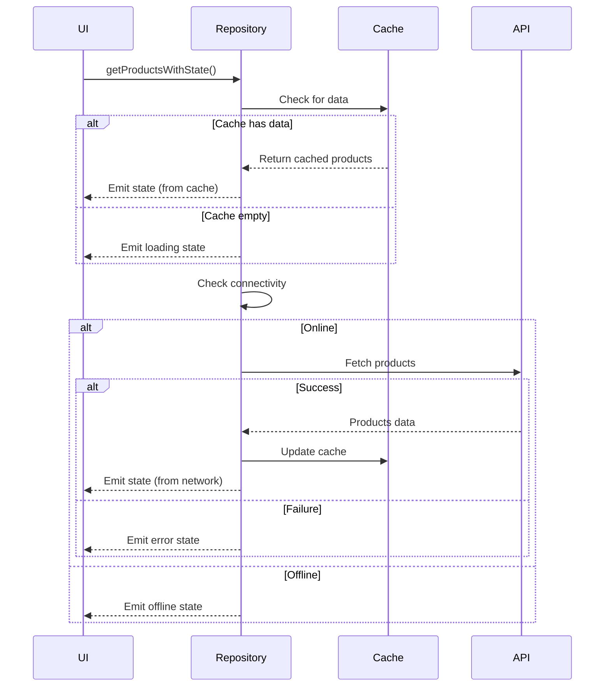

# ProductZ - Flutter Multi-Source Data Fetching App

A Flutter application demonstrating robust data fetching and caching strategies with multiple data sources, ensuring seamless user experience under varying network conditions.

## 📱 Features

- **Multi-Source Data Loading**: Fetches data from local cache first, then updates from network
- **Smart Caching**: In-memory cache with automatic staleness detection (5 minutes)
- **Offline Support**: Gracefully handles offline scenarios with cached data
- **Real-time Status Updates**: Visual indicators for different data states
- **Pull-to-Refresh**: Manual refresh capability
- **Error Handling**: Fallback mechanisms for network failures

## 🏗️ Architecture

### Repository Pattern Implementation

The app follows the Repository Pattern with a clear separation of concerns:

```
┌─────────────────┐     ┌──────────────────┐     ┌─────────────────┐
│   UI Layer      │ ──► │ Repository Layer │ ──► │  Service Layer  │
│   (Screens)     │     │ (ProductRepo)    │     │  (API/Cache)    │
└─────────────────┘     └──────────────────┘     └─────────────────┘
        ▲                         │
        │                         ▼
        │                 ┌──────────────────┐
        └─────────────────│  State Stream    │
                          │(ProductLoadState)│
                          └──────────────────┘
```

### Key Components

1. **ProductRepository**: Central orchestrator for data fetching
   - Manages data source priority (Cache → Network)
   - Handles state transitions
   - Monitors connectivity changes
   - Implements staleness detection

2. **CacheService**: In-memory cache implementation
   - Non-persistent storage (as per requirements)
   - Timestamp tracking for staleness
   - Simple List-based storage

3. **ApiService**: Network layer
   - Fetches from FakeStoreAPI
   - Configurable latency simulation
   - Error simulation for testing

4. **ProductLoadState**: Comprehensive state model
   - Tracks data source (cache/network)
   - Loading/refreshing states
   - Error handling
   - Offline status
   - Last fetch timestamp

## 🔄 State Management

### Riverpod + Streams

We chose Riverpod with Streams for state management because:

1. **Reactive Updates**: StreamProvider automatically rebuilds UI on state changes
2. **Async Handling**: Built-in support for asynchronous operations
3. **Provider Composition**: Easy dependency injection and testing
4. **Memory Safety**: Automatic disposal of resources

```dart
// Stream of ProductLoadState updates
final productStateStreamProvider = StreamProvider<ProductLoadState>((ref) {
  return ref.read(productRepositoryProvider).getProductsWithState();
});
```

## 📊 Data Flow Logic

### Initial Load Sequence



### Staleness Detection

The cache is considered stale when:

- No data exists in cache
- Last fetch was more than 5 minutes ago
- User manually triggers refresh

When stale data is detected:

1. Show cached data immediately (if available)
2. Display "refreshing" indicator
3. Fetch fresh data from network
4. Update cache and UI

## 🎯 Testing Different States

### 1. Fresh Cache State

- Launch the app
- Data loads from network (first time)
- Status bar shows "Products are up-to-date"

### 2. Cache Hit State

- Close and reopen the app within 5 minutes
- Data loads instantly from cache
- Status bar shows "Cached data (fresh)"

### 3. Stale Cache State

- Wait 5+ minutes after last fetch
- Reopen the app
- Status bar shows "Cached data (needs refresh)"
- Automatic refresh triggered

### 4. Offline Mode

- Turn on airplane mode
- Try to refresh
- Status bar shows "Offline mode - showing saved data"

### 5. Network Error State

- Modify `ApiService` to simulate errors:

```dart
final apiService = ApiService(simulateError: true);
```

- App falls back to cached data
- Error message displayed

### 6. Pull-to-Refresh

- Pull down on the product list
- Manual refresh triggered
- Status updates accordingly

## 🚀 Running the Project

### Prerequisites

- Flutter SDK (3.0+)
- Dart SDK
- Android Studio / VS Code

### Setup Instructions

1. Clone the repository:

```bash
git clone https://github.com/yourusername/productz.git
cd productz
```

2.Install dependencies:

```bash
flutter pub get
```

3.Run the app:

```bash
flutter run
```

### Testing Network Scenarios

To test different network conditions:

1. **Simulate Network Latency**:

```dart
// In providers.dart
final apiServiceProvider = Provider<ApiService>((ref) => 
  ApiService(simulatedLatency: Duration(seconds: 5))
);
```

2.**Simulate Network Errors**:

```dart
// In providers.dart
final apiServiceProvider = Provider<ApiService>((ref) => 
  ApiService(simulateError: true)
);
```

3.**Test Offline Behavior**:

- Use device airplane mode
- Or disconnect WiFi/mobile data

## 📁 Project Structure

```
lib/
├── main.dart                 # App entry point
├── models/
│   └── product.dart         # Product data model
├── providers/
│   └── providers.dart       # Riverpod providers
├── repository/
│   └── product_repository.dart  # Data orchestration
├── screens/
│   ├── splash_screen.dart   # Initial splash
│   ├── main_navigation_screen.dart
│   ├── product_list_screen.dart  # Main product list
│   └── profile_screen.dart
└── services/
    ├── api_services.dart    # Network layer
    └── cache_services.dart  # In-memory cache
```

## 🔧 Configuration

### Cache Staleness Duration

Change in `cache_services.dart`:

```dart
bool get isCacheStale {
  // Change 5 to any number of minutes
  return DateTime.now().difference(_lastFetchTime!).inMinutes > 5;
}
```

### API Endpoint

Change in `api_services.dart`:

```dart
final String _apiUrl = "https://your-api-endpoint.com/products";
```

## 📝 Key Design Decisions

1. **In-Memory Cache**: Used simple List storage instead of persistent database to meet requirements
2. **Stream-Based State**: Provides real-time updates without manual state management
3. **Connectivity Monitoring**: Proactive network state detection for better UX
4. **Status Bar**: Clear visual feedback for all data states
5. **Error Resilience**: Always show cached data when available, even on errors

## 🎨 UI States

The app clearly indicates different states through a colored status bar:

- 🟢 **Green**: Fresh data, up-to-date
- 🟡 **Yellow/Amber**: Stale cache or warning
- 🟠 **Orange**: Refreshing or offline with cache
- 🔵 **Blue**: Loading
- 🔴 **Red**: Error with no cache
- ⚫ **Grey**: Offline with no data

## 🧪 Testing Checklist

- [ ] App shows cached data immediately on launch
- [ ] Network fetch happens automatically after cache load
- [ ] Status bar updates correctly for each state
- [ ] Pull-to-refresh works
- [ ] Offline mode shows appropriate messages
- [ ] Error handling falls back to cache
- [ ] Stale data triggers auto-refresh
- [ ] Manual refresh works via app bar icon

## 📄 License

This project is created for educational purposes as part of a Flutter development assessment.
